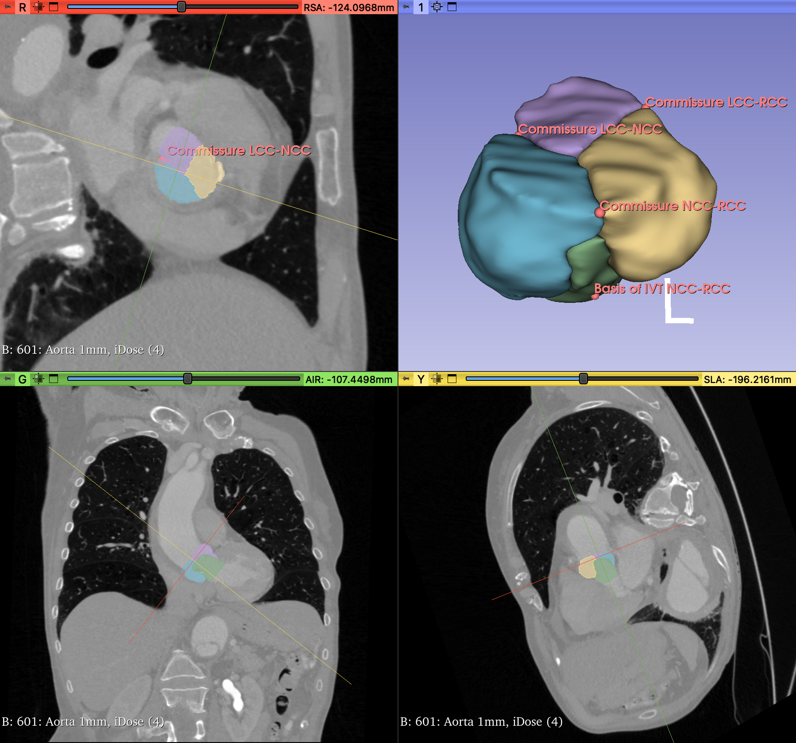

# Heart-Valve-Segmentor and Landmark detection

## TO DO -> Segmentation
- [x] Look at data
- [x] Create a GitLab-repo
- [x] make DataLoader faster
- [x] (Work with MONAI)
- [x] Find work-around of using differently structured labels (background is last, instead of first label)
- [ ] Train **[nnU-Net](https://github.com/MIC-DKFZ/nnUNet)** to segment the heart valves ~~-> DynUNet (monai implementation of nnU-Net) "Project Monai folder on GitLab. Runs but takes 22 min for validation"~~
- [x] Create the tutorial on how to create the dataset.
- [x] Create full size dataset (with all the data)
- [x] Run the dataset through the preprocessing of nnUNet full size dataset (with all the data)
- [x] What is brilliant is that the data is sometimes flawed - some of the datasets are mismatched in form of having different files where the coordinate system has been different than for others. -> finally solved (every segmentation matches to the volume. Was a hassle.)
- [x] Take out all the files with the "mismatched voxels", so there are lots of clean images.
- [x] find out [which configuration](https://github.com/MIC-DKFZ/nnUNet/blob/master/documentation/how_to_use_nnunet.md) to train the model on (2d, 3d_fullres, **3d_lowres**). 
- [x] Think about using "only heart" or "only thorax" or ... images. According to Helene, nnUNet doesn't get on well with multiple modalities.
- [ ] **Train 5 folds of 3d_lowres model on the whole dataset and conduct validation.** *The model is being trained. As of 05.08 the training runs for 6 days, is at Epoch 410*

## To do -> Landmark detection:
- [x] [Clone Medical-Detection3d-Toolkit](https://github.com/qinliuliuqin/Medical-Detection3d-Toolkit)
- [x] Find way to use the landmark labels as they are presented by the dataset of the USB. -> Created program that takes the `.json`-files, takes out the coordinates and then saves them in a `.csv`. *Beware: possibly an issue with the coordinate system. The landmarks are saved in LPS, however there is another field called "orientation" that could be used to adapt that.*
- [x] Can I use `.nrrd` instead of `.nii.gz` ? so far - yes. The program uses sitk to open "any" filetype.
- [x] Copy CSA (5.3 Gb) from dbe-cia-wl20-01 to dbe-cia-sl19-01
- [x] Adapt the mialab22 framework [CSA](/home/juval.gutknecht/Projects/CSA) to function with the given data. (-> landmark mask generation)
- [x] Generate the dataset to train this detector model.
- [ ] **Train a 3D-landmark detector to detect the landmarks**
- [ ] Make the folder structure etc more beautiful and userfriendly.

## To do once both models work.
- [ ] Deploy the trained models to Specto
- [ ] Write and complete the README file.
- [ ] Upload to GitLab

**30.07.2024, 09:00 :** The model is being trained with Dataset012_USB_Heart_big by nnUNet with the configuration 3d_lowres because it yielded the best results (time and values) and the results will be saved in the nnUNet_results folder. The training takes place on cuda:3, cuda:4 and cuda:7

Then Train the model using "3d low res".
Folds: The splits have 130-131 training and 32-33 validation cases.

**02.08.2024, 17:00 :** Segmentation model still training (at epoch ~226). Meanwhile got the Landmark detection model trainer to work on a very small sample dataset. Next steps include preparing the whole dataset for the use on this model. Also, validating the parameters spacing, boundaries, ...

**05.08.2024, 11:30 :** Segmentation model at training (epoch ~410). Landmark detection model training on full dataset (Training set), epoch 18.

`Spacing fullres: "spacing": [0.4296875, 0.30000000000000004,0.4296875]`
`Spacing 3d lowres: "spacing": [1.2090815233627648, 0.8441587363114579, 1.2090815233627648]`

# README:
### Description
This project aims to segment the heart into five segments and also to detect landmarks in CT scans of hearts, anonymized and provided by the [University Hospital of Basel](https://www.unispital-basel.ch/).

The segments are:
- LVOT
- RCC
- LCC
- NCC
- BG

The landmarks are:
- Commissure LCC-RCC
- Commissure LCC-NCC
- Commissure NCC-RCC
- Nadir LC
- Nadir RC
- Nadir NC
- Basis of IVT LCC-RCC
- Basis of IVT LCC-NCC
- Basis of IVT NCC-RCC

### Visuals

### Installation
### Usage
### Roadmap
### Authors and acknowledgment
Juval Gutknecht

### License
[Center for medical Image Analysis and Navigation, Department of Biomedical Engineering, University of Basel](https://dbe.unibas.ch/en/cian/)

# Appendix
## Findings
### Data
217 Folders containing the `.nrrd` volume file (sometimes there are several, i.e. once cropped, once not), the `.nrrd` segmentation file and one or several `.mrk.json` markup files.

- "Herz" Files: 103
- "Thorax/Abdomen" Files: 100
- Other Files: 13

Issues with 13 labels -> put whole contents of the BS-XXX folders into an `.ignore` folder:
- BS-339_11_Angio_Fl_Ao.Bo.Herz_axial___60%.nrrd
- BS-054_6_Herz__0.6__I30f__3__60%.nrrd
- BS-475_9_Herz__0.6__I26f__3__60%.nrrd
- BS-320_7_Herz__0.6__I30f__3__60%.nrrd
- BS-103_5_Fl_Thoracica__1.0__I26f__3__60%.nrrd
- BS-039_7_Herz___0.6__I26f__3__BestDiast_68_%.nrrd
- BS-582_8_Cor__Fl_Thx-Abd__0.6__I26f__3__60%.nrrd
- BS-255_8_Herz__1.0__Bv40__3__BestDiast_65_%.nrrd
- BS-053_12_Herz__0.6__I26f__3__70%.nrrd
- BS-055_404_PARENCHYME_1.5_iDose_(3).nrrd
- BS-469_8_Fl_Thoracica__1.0__I26f__3__60%.nrrd
- BS-061_6_Herz__0.6__I26f__3__BestDiast_68_%.nrrd
- BS-036_5_Fl_Herz__0.6__Bv40__3__65%.nrrd

**NEW Stats**
- "Herz" Files: 94
- "Thorax/Abdomen" Files: 97
- Other Files: 12

Now: Use all files that do not exit with an error to create dataset. Even the ones that do not have "Herz", "Thorax" or so in their name have the same segmentation masks.

This should result in a dataset consisting of 203 images and segmentations as well as landmarks BEFORE the splitting up of the data (80% Training, 20% Testing).

The dataset is then Validated by nnUNet and the datasets are prepared automatically (163 training images, rest for validation/testing).
