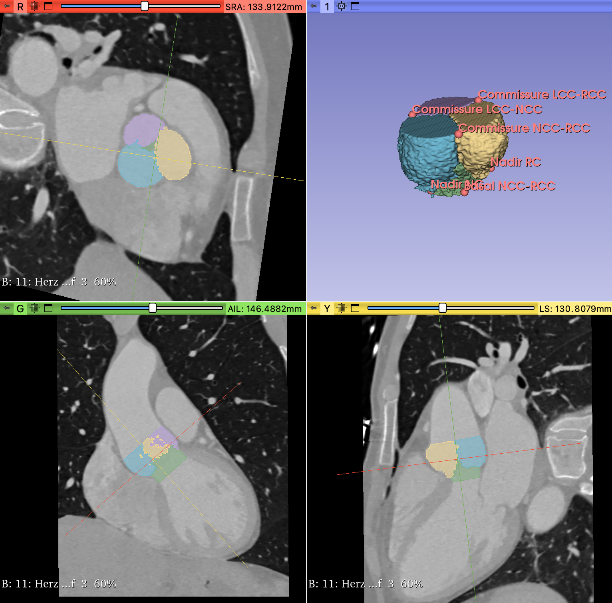

# Heart-Valve-Segmentor

## To do
- [x] Look at data
- [x] Create a GitLab-repo
- [ ] get TensorBoard working
- [ ] make DataLoader faster
- [ ] (Work with MONAILabel to extract labels)
- [ ] Train nnU-Net to segment the heart valves -> DynUNet (monai implementation of nnU-Net)
- [ ] Train a 3D-landmark detector to detect the landmarks
- [ ] Deploy the trained models to Specto
- [ ] Write and complete the README file.

## README:
### Description
This project aims to segment the heart into five segments and also to detect landmarks in CT scans of hearts, anonymized and provided by the [University Hospital of Basel](https://www.unispital-basel.ch/).

The segments are:
- LVOT
- RCC
- LCC
- NCC
- BG

The landmarks are:
- Commissure LCC-RCC
- Commissure LCC-NCC
- Commissure NCC-RCC
- Nadir RC
- Nadir NC
- Basal NCC-RCC

### Visuals

### Installation
### Usage
### Roadmap
### Authors and acknowledgment
Juval Gutknecht

### License
[Center for medical Image Analysis and Navigation, Department of Biomedical Engineering, University of Basel](https://dbe.unibas.ch/en/cian/)